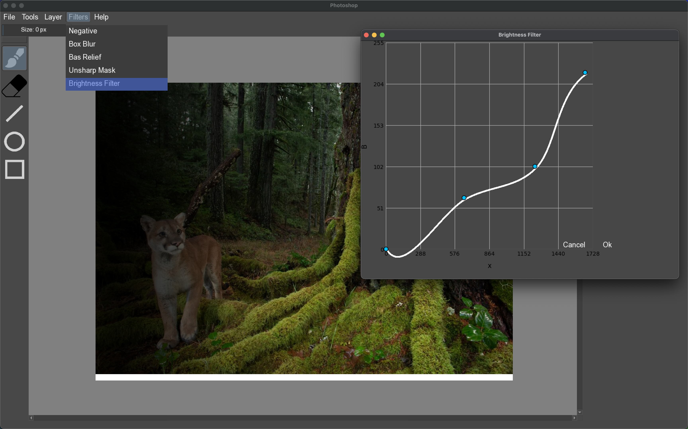
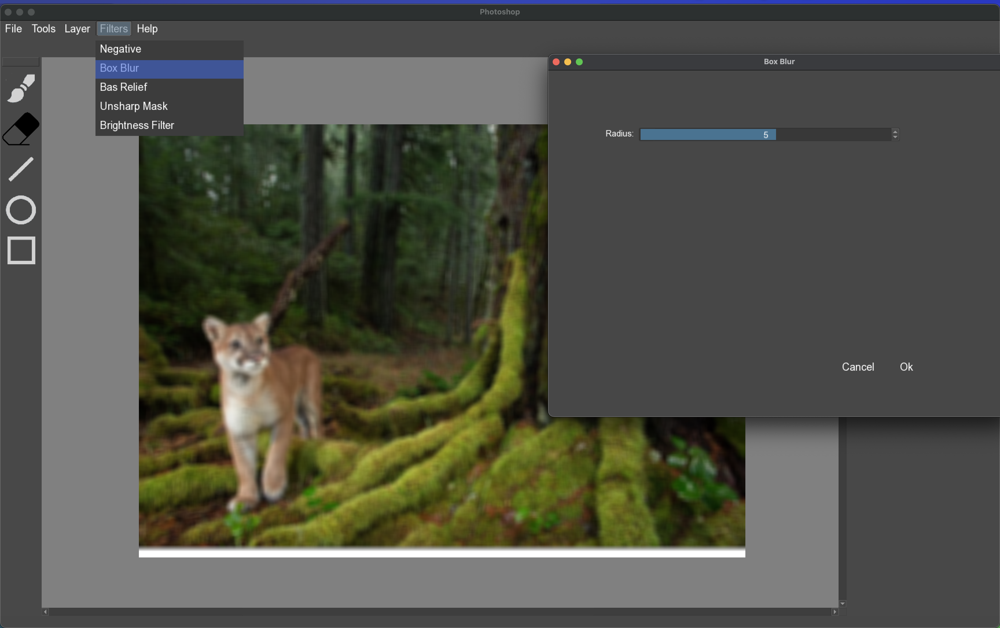

# Image Editor

## Installation and Run

This project utilizes SFML.

```
git clone https://github.com/d3clane/MyPhotoshop
make
./build/bin/ps.out
```

## Project Goal

The main goal of the project is to get used to teamwork and plugin-based architecture.  

The first step of the project was to define a standard (API) in our study group and approve it. This API specifies how plugins and the image editor interacts, so that we can code plugins independently of the concrete implementation.

As expected, the initial API had limitations. After a few time, we came up with the second version of standard that fixed many issues.  

## API Architecture

The core idea of the API is that everything is a plugin. Like, literally - everything. While some plugins, such as the canvas, toolbar, and menu bar, are considered system plugins, they still follow the plugin model. A plugin can request Photoshop to provide a pointer to a specific window on the screen and use this pointer for interaction. For example, the brush plugin requests a pointer to the canvas for drawing and a pointer to the toolbar to add itself as a tool.  

In this paradigm, plugins can do anything they want with no limitations - something that we wanted, and something we achieved.

Each plugin has an action - a task executed for each polled event. These actions are managed using the `Action Controller`, enabling features like undo. 

Obviously, API has to be independent of any specific graphics library (e.g., SFML). It standardizes a common graphics shell - so, switching to a different library doesn't lead to rewriting the whole project.

## Photoshop Features

Here’s how it looks (design inspired by Krita):  

  

### Key Features  

The screen is divided into:  
1. **Canvas**  
2. **Toolbar** (left bar with eraser, brush, etc.)  
3. **Menu Bar** (top bar with file, tools, filters, etc.)  
4. **Options Bar** (tool options like size slider and color palette (hidden by brightness filter render window)).  

Let’s dive deeper into each part:

### Canvas  

The canvas is simple:  
- **Scrollable**: Two scrollbars - upside-down and left-right. Functions like in other GUI applications.  
- **Undoable**: Plugins can take snapshots and restore the canvas from it at any time. Combining this with `Action Controller` results in undoable canvas. 

### Toolbar  

The toolbar contains tools. In this project, I implemented:  
1. **Brush**  
2. **Eraser**  
3. **Shapes** (line, ellipse, rectangle)  

Implementing the brush and eraser required interpolation since events were not processed often enough to draw continuous lines. I implemented Catmull-Rom interpolator, added points to it and drew lines based on the interpolated points.  

### Options Bar  

Toolbar tools can define specific options for more precise tuning. Standardized options are:  
1. Thickness  
2. Opacity  
3. Color palette  

Plugins can choose which options to add or define custom options for their functionality.  

### Menu Bar  

The menu bar contains:  
1. **File**  
2. **Tools**  
3. **Layer**  
4. **Filters**  
5. **Help**  

- **File**: Includes options to open and save files.  
- **Tools**: Features "Do" and "Undo" buttons for canvas interaction.  

The most interesting button - Filters.

#### Filters  

I implemented five filters:  
1. Negative  
2. Box Blur  
3. Bas Relief  
4. Unsharp Mask  
5. Brightness Filter (shown in the screenshot)  

Each filter opens a render window with customizable options and "Ok / Cancel" buttons.  

For instance:  
- **Brightness Filter**: Opens an interactive graph for pixel brightness adjustments.  
- **Box Blur**: Provides a slider to control the blur radius. Here how it looks like:

  

## Conclusion  

If you’d like to try coding a plugin using our API, you can find it in the [api](/include/api/) folder.  
